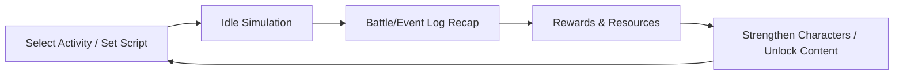

# CODEX-WUXIA Repository Aggregated Content

This document consolidates every tracked file in the repository into a single reference.

## README.md

```markdown
# CODEX-WUXIA

Design assets and documentation for a text-driven idle wuxia RPG inspired by *九陰真經*.

## Documentation
- [High-level design overview](docs/design.md)
  - [Combat system specification](docs/combat_system.md)
  - [Combat core prototype outline](docs/combat_prototype.md)
- [Move system blueprint](docs/move_system.md)

## Prototype

The repository now ships with a lightweight Python prototype that replays a 1v1 duel using the documented action-gauge and拆招 rules.

```
python -m codex_wuxia.cli.simulate --ticks 32 --actions 24
```

The command prints a chronological battle log showing gauge growth, counter triggers, and resulting narration beats.

```

## docs/design.md

```markdown
# Wuxia Idle Game Design Overview

## Vision
Create a text-driven idle (AFK) wuxia RPG that marries the strategic depth of "九陰真經" with lightweight UI animations. Players witness richly described martial duels while configuring automation rules that continue to run while they are offline.

## Core Pillars
1. **Speed-Driven Combat** – Battles are resolved through an action gauge that emphasizes "以快制慢" and reactive counterplay.
2. **Idle Growth Loop** – Characters train, gather loot, and trigger story events automatically, returning with a battle log recap.
3. **Narrative Flexibility** – Modular text templates and events let designers rapidly add new moves, encounters, and story arcs.

## Player Fantasy
- **Role**: A wandering martial artist that eventually establishes a martial hall, recruiting spirits/disciples (武魂/俠客) with unique traits.
- **Motivation**: Master rare manuals, cultivate inner power, and discover the secrets of the Nine Yin Manual.
- **Engagement**: Configure builds, read stylized battle logs, respond to pop-up incidents, and trade loot via the auction house.

## High-Level Loop


## Feature Roadmap
| Phase | Scope | Goal |
| --- | --- | --- |
| **Prototype** | Core combat (speed gauge, text renderer), simple idle simulation, manual list of moves | Validate feel of "文字＋動畫" battles |
| **Alpha** | Character growth (experience, equipment), idle job board, modular events, minimal UI | Provide long-term retention hooks |
| **Beta** | Auction house, multiplayer raids (team co-op), ladder (華山論劍), expanded storytelling | Support community-oriented systems |

## Combat System Detail
### Action Gauge
- Each combatant owns a gauge with threshold `ActionThreshold` (e.g., 1000).
- Gauge increases per tick: `Increment = BaseSpeed * BuffMultiplier + RandomJitter`.
- When gauge ≥ threshold, combatant acts, spending `ActionCost` (~threshold) and possibly retaining overflow for quick follow-up.
- Soft cap on speed ensures diminishing returns to prevent infinite loops.

### Action Resolution Steps
1. **Determine Intent**: Use scripting AI or player choice to pick a move.
2. **Pre-Action Checks**: Resolve control effects (stuns, slows, immobilize).
3. **Narrative Template**: Fetch move template by tier (起勢/出招/收招) and apply character traits.
4. **Mechanical Resolution**:
   - Hit chance via `Accuracy vs. Evasion` influenced by yin/yang alignment.
   - Damage formula factoring weapon tier, inner power, combo chains.
   - Counter/拆招 check if defender has reactive move queued.
5. **Aftermath**: Apply buffs/debuffs, adjust gauge modifiers, log textual outcome, trigger lightweight animation cue.

### Move Taxonomy
- **Weapon Families**: 拳掌、劍、刀、槍、棍、暗器、鞭。
- **Flow Structure**: Each move defined by `setup`, `strike`, `afterglow` segments for text & animation alignment.
- **Tags**: `yin/yang`, `hard/soft`, `range`, `speedBias`, `counterType`.
- **Learning Path**:
  - `Foundation`: unlocks basic moves within a family.
  - `Specialization`: branches that reward consistent usage (熟練度) or quest completion.
  - `Ultimate`: rare manuals requiring specific yin-yang balance, event tokens, or inner power thresholds.

### Counterplay Mechanics
- **拆招**: Defender compares `CounterRating + SpeedDelta` vs. attacker `Momentum`. Success interrupts and plays reactive template.
- **以柔克剛**: Soft-tagged moves reduce damage from hard-tagged opponents, encouraging loadout variety.
- **身法 Adjustments**: Certain moves temporarily boost/decrease action gauge gain, capturing "快慢互制" feel.

## Idle Simulation
- **Activity Types**: Wilderness grinding, sect meditation, escort missions, manual research.
- **Scheduling**: Player sets duration & priority; simulation generates resource yields + event seeds.
- **Event Cards**: Weighted random draws (奇遇, 衝突, 機緣). Each card stores condition checks and narrative outputs.
- **Offline Handling**: Server processes ticks; upon return, compile battle/event summaries grouped by activity.

## Progression Systems
- **Attributes**: `Qi`, `InnerPower`, `Speed`, `Technique`, `Will`. Derived stats feed combat formulas.
- **Equipment**: Weapon/armor/accessory slots with rarity, reforging, socket runes (加速, 拆招率, 內功恢復).
- **Meridians (經脈)**: Node graph representing the Eight Extraordinary Meridians + Twelve Principals. Unlocking nodes grants passive stats and occasionally new reactive options.
- **Companions**: Recruitable spirits/disciples with unique move pools, loyalty arcs, and synergy bonuses.

## Meta Systems
- **Auction House**: Player-to-player listings with taxes, batch posting automation.
- **Competitive Modes**: 華山論劍 ladder (async PvP), timed trials, sect wars.
- **Narrative Delivery**: Episodic chronicles triggered by milestone completions, delivered through formatted logs.

## Content Pipeline
- **Data-Driven Definitions**: Moves, events, NPCs, and templates stored in JSON/YAML for quick iteration.
- **Tooling Ideas**: Simple script to preview text sequences, gauge fill simulation visualizer, balancing spreadsheets.
- **Localization Friendly**: Keep narrative templates modular with placeholders (`{attacker}`, `{moveName}`, `{effect}`) for future translation.

## Implementation Steps
To keep progress tangible, execute the plan in sequential milestones. Each step produces assets or tooling that feed the next.

1. **Combat Core Prototype**  
   - Implement the action gauge loop outlined in [`combat_system.md`](combat_system.md).  
   - Support loading YAML move definitions following [`move_system.md`](move_system.md).  
   - Output battle logs with timestamped entries and placeholder animation cues.
2. **Move Library Seed**  
   - Author foundation moves for all seven weapon families.  
   - Add at least one specialization and one ultimate example per family to validate tier interactions.  
   - Verify counter windows, status hooks, and combo requirements inside the simulator.
3. **Idle Activity Skeleton**  
   - Create data schema for idle activities (grind, meditation, escort) including duration, rewards, and event weights.  
   - Produce mock battle/event recaps stitched from combat logs and event templates.
4. **Progression & Resources**  
   - Define experience curves, resource sinks (equipment upgrade, meridian unlocking), and economy pacing knobs.  
   - Link idle rewards to these sinks to ensure closed growth loops.
5. **UI Wireframes & Narrative Templates**  
   - Draft wireframes for battle viewer, activity planner, and recap inbox.  
   - Expand text template library with tone variants (陰柔、陽剛、詩意) for quick reuse.

Track completion of each milestone before expanding scope (e.g., auction house, multiplayer raids) to maintain steady iteration.

```

## docs/combat_system.md

```markdown
# Combat System Specification

## Goals
- Recreate the "以快制慢" tempo of wuxia duels through an action gauge that rewards speed without letting it dominate.
- Support text-first battle narration synchronized with lightweight animation cues.
- Provide hooks for counterplay (拆招), status effects, and scripted AI behaviours suitable for idle simulations.

## Core Concepts
### Action Gauge
- **Threshold**: `ActionThreshold = 1000` by default.
- **Tick Rate**: Simulation advances in `TickDuration = 0.25s` slices.
- **Increment Formula**: `Gauge += (BaseSpeed * SpeedScaling + BuffDelta + RandomJitter) * TickDuration`.
  - `BaseSpeed`: Derived from character stats, equipment, and active buffs.
  - `SpeedScaling`: Default `1.0`; can be adjusted globally for encounter pacing.
  - `BuffDelta`: Sum of additive modifiers from moves or statuses.
  - `RandomJitter`: Optional ±3% noise to avoid deterministic loops.
- **Overflow Handling**: Upon acting, subtract `ActionThreshold`; leftover value carries toward next turn.
- **Soft Cap**: Apply diminishing returns when `BaseSpeed` exceeds encounter `SpeedSoftCap`:
  ```
  EffectiveSpeed = BaseSpeed if BaseSpeed <= SpeedSoftCap
                  else SpeedSoftCap + (BaseSpeed - SpeedSoftCap) * 0.35
  ```

### Turn Resolution Pipeline
1. **Ready Check**: When gauge ≥ threshold and combatant is not stunned/rooted.
2. **Intent Selection**:
   - Idle AI consults a scripted priority list (`MoveScripts`) with condition checks (hp %, enemy tags, cooldowns).
   - Player-configured script slots for manual override.
3. **Pre-Action Triggers**:
   - Resolve start-of-turn statuses (e.g., poison ticks, stance decay).
   - Evaluate counter windows—defender may pre-empt if holding a `PreparedCounter`.
4. **Narrative Rendering**:
   - Assemble text from move template segments `setup`, `strike`, `afterglow` with contextual substitutions.
   - Emit animation cues (e.g., `"slash_arc"`) for the UI layer.
5. **Mechanical Resolution**:
   - `HitChance = BaseAccuracy + AccuracyBuffs - TargetEvasion`.
   - On hit, compute damage via `BaseDamage * (1 + YinYangBonus + ComboMultiplier) - TargetMitigation`.
   - Trigger secondary effects (bleed, slows, buffs) defined on the move.
6. **Aftermath**:
   - Apply gauge modifiers (`Gauge += MomentumBonus` or `Gauge *= SlowFactor`).
   - Queue counter opportunities: defending characters gaining `CounterPrepared` for X ticks.
   - Log outcome to battle transcript with severity tags (`success`, `countered`, `fumble`).

### Counterplay &拆招
- **Counter Rating (`CR`)**: Derived from stats, move tags, and statuses.
- **Counter Window**: Moves with `counterTag` grant defenders a window measured in ticks. If defender gauge ≥ `CounterThreshold` before window expires, a counter action triggers.
- **Resolution**:
  - `CounterScore = Defender.CR + SpeedDelta + CounterBonuses`.
  - `AttackScore = Attacker.Momentum - CounterPenalties`.
  - If `CounterScore >= AttackScore`, attacker is interrupted; play `counter` template and optional reversal damage.
  - On failure, defender loses `CounterPrepared` but gains a minor speed boost to signal near-miss.

### Status Effects
- **Buff**: Positive effect with duration in ticks and stacking rules (`stack`, `refresh`, `exclusive`).
- **Debuff**: Negative effect with cleanse difficulty and potential to reduce gauge gain.
- **Stance**: Special buff altering move availability (e.g., `凌波身法` enabling speed surges). Only one stance active per character.

## Data Structures
```yaml
MoveDefinition:
  id: string
  name: string
  weaponFamily: [拳掌|劍|刀|槍|棍|暗器|鞭]
  tier: [foundation|specialization|ultimate]
  tags: [yin, soft, counter]
  speedBias: float   # modifies gauge after use (e.g., 0.9 for faster follow-up)
  cost:
    qi: int
    stamina: int
  template:
    setup: ["{attacker}沉肩墜肘，氣沉丹田。"]
    strike: ["一記『{moveName}』疾攻而至，掌風如驟雨。"]
    afterglow: ["{defender}胸口氣血翻湧，退後三步。"]
  effects:
    damage:
      base: 120
      scaling:
        innerPower: 1.1
        technique: 0.4
    statusesApplied:
      - id: "stagger"
        chance: 0.35
        durationTicks: 6
    counterWindow:
      ticks: 4
      counterTemplate: "{defender}以柔化剛，借力打力。"
```

## Sample Tick Pseudocode
```python
for tick in ticks:
    for combatant in combatants:
        combatant.gauge += compute_increment(combatant, tick)
        if combatant.can_act():
            action = combatant.choose_action()
            resolve_pre_action(action)
            render_text(action)
            resolve_mechanics(action)
            resolve_aftermath(action)
```

## Example Battle Flow
The following walkthrough demonstrates how the gauge, counter windows, and narration interplay during a short duel. It assumes
the default `ActionThreshold = 1000` and `TickDuration = 0.25s`.

| Tick | Actor Gauge | Defender Gauge | Event | Narration Highlight |
| ---- | ----------- | -------------- | ----- | ------------------- |
| 0.00 | 0 / 1000 (陸雲) | 0 / 1000 (秦霜) | Initialization | `陸雲沉肩調息，秦霜身形如竹。` |
| 0.25 | 180 | 140 | Gauges advance by base speed (陸雲 720、秦霜 560). No one ready. | — |
| 0.50 | 360 | 280 | 陸雲預設快攻套路《飛燕連環》進入候選。 | `陸雲腳尖點地，身影晃動。` |
| 0.75 | 540 | 420 | 秦霜準備拆招《柔雲化勁》，被標記為 `CounterPrepared`。 | `秦霜氣脈沉穩，掌心柔力如潮。` |
| 1.00 | 720 | 560 | 陸雲 gauge ≥ 1000? 尚未；但 momentum buff (+120) 讓下個 tick 可超標。 | — |
| 1.25 | 900 | 700 | 陸雲仍未達閾值；秦霜 gauge 700 尚無法拆招。 | — |
| 1.50 | 1080 | 840 | 陸雲 first to act，施展《飛燕連環》。Gauge 扣除 1000 後餘 80。 | `掌影如燕掠空，連出三記快拍。` |
|      |           |                | Counter Check | 秦霜 gauge 840 ≥ `CounterThreshold` 600，觸發拆招比較：`CounterScore = 65 + (840-80)/10 = 149`，`AttackScore = 120`，成功。 |
|      |           |                | Counter Action | `秦霜掌心柔力一轉，借勢拍向陸雲胸口。` 攻擊中斷，陸雲 gauge 清零並施加 `slow`。秦霜獲得 200 gauge 奬勵。 |
| 1.75 | 200 | 40 | 陸雲因 `slow` 下次增量僅 120；秦霜經反制獲得先手機會。 | — |
| 2.00 | 320 | 520 | 秦霜 gauge ≥ 1000? 尚未，但下一 tick 將達到。 | — |
| 2.25 | 440 | 1000 | 秦霜 gauge 達 1000，施展《太虛雲掌》，造成 210 傷害並附 `stagger`。 | `雲掌柔中帶剛，陸雲氣血翻湧。` |
| 2.50 | 560 | 240 | 陸雲受到 `stagger`，下次可行動門檻提高 15%。 | `陸雲連退數步，尚需調息。` |
| 2.75 | 680 | 380 | 雙方進入下一輪節奏，戰鬥持續。 | — |

Key takeaways:
- **速度差帶來節奏優勢**：陸雲起手較快，但秦霜透過拆招逆轉先手。
- **拆招與狀態交織**：成功拆招立即重置攻擊者行動槽並施加 `slow`，為後續《太虛雲掌》鋪路。
- **敘事與數值同步**：每個事件皆對應文字段落與可觸發的動畫 cue，方便 UI 轉接。

## Logging & Replay
- Maintain chronological log entries with fields: `timestamp`, `actor`, `target`, `moveId`, `outcome`, `text`, `animationCue`.
- Aggregate logs into digestible segments for idle recap (e.g., group every 5 actions into a paragraph).

## Balancing Hooks
- Expose `SpeedSoftCap`, `CounterThreshold`, and `HitChanceFloor` via configuration files for quick tuning.
- Include telemetry counters (average gauge per minute, counter success rate) to guide balancing passes.

## Next Actions
1. Implement gauge simulator CLI that reads YAML move definitions and prints battle logs.
2. Author baseline move set per weapon family following the schema above.
3. Create unit tests covering gauge overflow, counter success/failure, and status stacking.
```

## docs/move_system.md

```markdown
# Move System Blueprint

## Objectives
- Offer a layered progression from foundational techniques to signature ultimates for each weapon family.
- Ensure every move carries tags that influence combat AI, counterplay, and textual flavor.
- Provide designers with a data-driven template to add new moves without touching core code.

## Progression Tiers
1. **Foundation (入門)**
   - Unlock prerequisite for the weapon family.
   - Grants passive familiarity bonus: `+5%` hit chance and `+3%` counter resistance against matching family.
   - Learned via sect instructors or starting manuals.
2. **Specialization (專精)**
   - Requires foundation move at Rank 3 (熟練度 milestone) and completion of weapon-specific trials.
   - Introduces branching mechanics such as combo chains, stance switching, or status infliction.
   - Costs rare resources (e.g., sect reputation, manual fragments).
3. **Ultimate (絕學)**
   - Tied to major story events or legendary manuals.
   - Often mixes weapon families or leverages yin-yang balance thresholds.
   - Provides unique battle log templates with cinematic wording and bespoke animation cues.

## Weapon Families & Sample Flows
| Weapon | Core Fantasy | Foundation Example | Specialization Path | Ultimate Hook |
| ------ | ------------ | ------------------ | ------------------- | ------------- |
| 拳掌 | Close-range control,拆招追擊 | **羅漢推山**：陰剛，提升拆招成功率 | **螳螂纏腕**（連鎖抓取）或**太極推手**（以柔化剛） | **降龍十八掌**：連續爆發，對陽剛敵人追加震退 |
| 劍 | 流暢連段，高命中 | **清風十三劍**：陽柔，式目連接 | **青城劍閣**（身法加速）或**獨孤九劍**（拆招專精） | **天外飛仙**：速度突破，首段必中 |
| 刀 | 爆發與破甲 | **狂風刀勢**：陽剛，首擊破甲 | **血影斬**（吸血）或**霸刀弦月**（蓄勢斬） | **伏魔刀歌**：斬殺線，擊倒低血敵人 |
| 槍 | 中距離壓制、突刺 | **破雲鎗**：陽剛，距離控制 | **霸王槍**（擊退）或**化骨游龍**（穿刺多段） | **一氣化三清**：三段攻擊，附加慢速 |
| 棍 | 守禦與群控 | **伏虎棍**：陰剛，格擋提升 | **少林羅漢陣**（群攻）或**天罡北斗**（結界加護） | **降魔金身棍**：反彈傷害且群體嘲諷 |
| 暗器 | 插招與異常 | **袖裡針**：陰柔，插入行動槽 | **孔雀翎**（範圍多段）或**七蟲七花**（毒疊加） | **群玉無光**：一次性爆發附帶致盲 |
| 鞭 | 範圍牽制、節奏干擾 | **靈蛇出洞**：陰柔，延緩敵方速度 | **九節遊龍**（距離掌控）或**天蠶絲雨**（多段軟控制） | **碧海潮生**：大範圍牽制並自加速度 |

## Move Data Fields
```yaml
rankedMove:
  moveId: "luohan_push"
  tier: foundation
  maxRank: 5
  unlock:
    requirements:
      - type: "weapon_mastery"
        weapon: "fist"
        level: 1
      - type: "quest"
        id: "shaolin_initiation"
  rankRewards:
    - rank: 1
      bonus: {hitChance: 0.05}
    - rank: 3
      bonus: {counterGuard: 0.08}
      grants: "mantis_wrap"
    - rank: 5
      bonus: {speedBias: -0.05}
```

## Familiarity & 熟練度
- Every move tracks `usageXP` accrued during battles (active or idle).
- Thresholds: `Rank1` unlocked on learn, `Rank2` at 50 uses, `Rank3` at 150, `Rank4` at 300, `Rank5` at 600.
- Rank rewards can modify text templates (unlocking new adjectives) and mechanical bonuses.

## Loadout Slots
- Characters have `Primary`, `Secondary`, and `Utility` slots.
- Foundation moves must occupy `Primary` to ensure weapon identity.
- Specialization moves can fill `Secondary`; ultimates usually consume `Utility` and have cooldown measured in gauge units (e.g., 2500).

## Synergy Tags
- `comboStarter`: increases hit chance if used immediately after a stance change.
- `finisher`: gains bonus damage if combo counter ≥2.
- `counterBreaker`: reduces defender counter rating by 20% for the current action.
- `stanceShift`: toggles character stance, altering subsequent script weights.

## Example Move Set (拳掌)
```yaml
moves:
  - id: "luohan_push"
    name: "羅漢推山"
    weaponFamily: "拳掌"
    tier: "foundation"
    tags: ["yang", "hard", "comboStarter"]
    speedBias: 1.05
    cost: {qi: 15, stamina: 10}
    template:
      setup: ["{attacker}扎馬沉肩，雙掌平推。"]
      strike: ["掌勁如山洪傾瀉，震得{defender}胸骨發麻。"]
      afterglow: ["勁道未歇，掌風仍在場中迴盪。"]
    effects:
      damage: {base: 140, scaling: {innerPower: 0.8, strength: 0.6}}
      statusesApplied:
        - {id: "armor_break", chance: 0.3, durationTicks: 8}
      gaugeMod: {multiplier: 0.92}
  - id: "mantis_wrap"
    name: "螳螂纏腕"
    weaponFamily: "拳掌"
    tier: "specialization"
    tags: ["yin", "soft", "counter"]
    speedBias: 0.85
    cost: {qi: 20, stamina: 18}
    template:
      setup: ["{attacker}雙臂盤旋，手勢如蟲臂。"]
      strike: ["忽而貼身纏住{defender}手臂，借勢反摔。"]
      afterglow: ["{defender}身形一滯，經脈被封。"]
    effects:
      damage: {base: 90, scaling: {technique: 1.1}}
      statusesApplied:
        - {id: "root", chance: 0.45, durationTicks: 5}
      counterWindow: {ticks: 6, bonusCR: 25}
  - id: "xianglong_combo"
    name: "降龍十八掌"
    weaponFamily: "拳掌"
    tier: "ultimate"
    tags: ["yang", "hard", "finisher"]
    cooldownGauge: 2500
    cost: {qi: 60, stamina: 45}
    template:
      setup: ["{attacker}怒吼一聲，真氣化龍。"]
      strike: ["十八掌如狂風暴雨般連綿不絕，掌影層疊。"]
      afterglow: ["{defender}被震得氣血倒流，胸口陣陣作痛。"]
    effects:
      damage: {base: 420, scaling: {innerPower: 1.6, strength: 0.9}}
      statusesApplied:
        - {id: "stagger", chance: 0.6, durationTicks: 10}
      special:
        comboRequirement: 2
        overflowDamage: 0.25
```

## Designer Workflow
1. Choose weapon family and determine role (starter, control, finisher).
2. Assign tier and define unlock requirements.
3. Write template lines with placeholders; ensure at least two variations per segment for freshness.
4. Configure mechanical effects and synergy tags.
5. Playtest via gauge simulator; adjust `speedBias`, damage scaling, and counter windows.

## Future Enhancements
- Introduce dual-weapon combos (e.g., 劍＋鞭) using combined templates.
- Add lineage bonuses: mastering three moves within a lineage unlocks a passive buff.
- Support localization metadata (tone indicators, voiceover cues).
```

## docs/combat_prototype.md

```markdown
# Combat Core Prototype Outline

## Prototype Goals
- 驗證「速度槽決定出手順序」的體感與數值節奏，確保能呈現以快制慢、以慢制快的武俠對決。
- 建立可重複運行的文字戰報輸出流程，為日後掛機模擬與 UI 動畫綁定提供資料接口。
- 測試拆招、反制、狀態與速度調整等核心互動是否能在簡化模型中成立。

## 最小可行範圍
1. **雙方對戰模型**：玩家與 AI 各自持有 1 套招式腳本與基礎屬性（速度、命中、拆招、真氣）。
2. **速度槽演算法**：以 0.25 秒為 tick，累積行動值達門檻（預設 1000）即出手，溢出的餘量保留。
3. **招式解析**：每個招式具備起勢、出招、收勢三段模板，附帶速度調整、命中、傷害與狀態設定。
4. **拆招窗口**：被攻擊者若持有對應拆招招式且行動槽達 60% 以上，可嘗試插入反制。
5. **戰報輸出**：每回合產出 JSON 事件（時間戳、行動者、招式、結果、文字段落、動畫 cue），並聚合成可閱讀的段落。

## 模組分解
- **Simulation Loop**
  ```python
  while not battle_over:
      advance_gauges()
      ready = pick_ready_combatants()
      for actor in ready:
          intent = actor.choose_move()
          counter = check_counter(actor, intent)
          log_setup(actor, intent, counter)
          resolve_mechanics(actor, intent, counter)
          apply_aftermath(actor, intent)
          snapshot_state()
  ```
- **Data Definitions**（YAML）
  ```yaml
  combatant:
    name: "江湖散人"
    baseSpeed: 380
    stats:
      accuracy: 65
      counter: 55
      resilience: 40
    script:
      - if: "enemy.hp_percent < 0.35"
        move: "斷魂刀"
      - if: "self.qi < 40"
        move: "吐納養氣"
      - else: "連環三式"
  ```
- **Narrative Templates**
  - `setup`: "{actor}身形一晃，氣息如潮。"
  - `strike`: "使出《{move}》，刀光連成殘月。"
  - `afterglow`: "{target}被逼得連退數步，真氣震盪。"

## 速度與拆招交互
| 狀況 | 判定條件 | 敘事重點 | 數值結果 |
| ---- | -------- | -------- | -------- |
| 以快打慢 | 攻擊者速度 ≥ 防禦者 + 60 | 「殘影連閃」「前招未息又起後招」 | 攻擊者獲得 `MomentumBonus = +120` 行動值 |
| 以慢制快 | 防禦者速度 ≤ 攻擊者 - 80 且持有柔性拆招 | 「以柔化剛」「後發先至」 | 若拆招成功，攻擊者行動槽清空、受 `slow` |
| 以快制快 | 雙方速度差 < 30 | 「身影交錯」「電光火石」 | 進行搶先檢定：`speed + 隨機(0,30)`，高者先動 |

## 事件樣本
```json
{
  "timestamp": 3.25,
  "actor": "慕容煙",
  "move": "風捲殘雲",
  "phase": "strike",
  "text": "慕容煙腳踏凌波，掌勢如暴雨傾瀉。",
  "animation": "palm_flurry",
  "outcome": {
    "hit": true,
    "damage": 184,
    "status": ["stagger"]
  }
}
```

## 驗證任務
1. **節奏檢查**：以 300 vs 450 速度的角色對戰，確定高速方出手頻率約為 1.5 倍而非無限輪迴。
2. **拆招測試**：設計一組柔性拆招招式，確認對抗爆發型刀法時能觸發反制敘事並重置對手行動槽。
3. **敘事一致性**：模擬 10 回合戰鬥，人工檢視輸出文字是否流暢、動畫 cue 是否合理。
4. **資料輸出**：確保戰報可序列化為 JSON，並提供聚合工具（例如將 5 筆事件組成一段落）。

## 後續擴充點
- 引入多角色混戰與隊伍技能，驗證群戰速度與拆招是否仍穩定。
- 加入怒氣／內勁槽，提供爆發或插招的資源管理層。
- 與掛機系統連動：模擬 10 分鐘掛機戰鬥，統計平均收益與招式熟練度成長。

```

## codex_wuxia/__init__.py

```python
"""Prototype modules for the CODEX Wuxia combat simulator."""

__all__ = ["combat"]
```

## codex_wuxia/cli/simulate.py

```python
"""Command line entry point for running the sample duel."""

from __future__ import annotations

import argparse
from pathlib import Path

from ..combat.engine import BattleSimulator
from ..combat.loader import load_combatants, load_moves


def run_simulation(moves_path: Path, duel_path: Path, max_ticks: int, max_actions: int) -> None:
    moves = load_moves(moves_path)
    combatants = load_combatants(duel_path)
    simulator = BattleSimulator(combatants, moves)
    result = simulator.run(max_ticks=max_ticks, max_actions=max_actions)
    for entry in result.log:
        if entry.target:
            print(f"[{entry.timestamp:5.2f}] {entry.actor} -> {entry.target} | {entry.event}: {entry.text}")
        else:
            print(f"[{entry.timestamp:5.2f}] {entry.actor} | {entry.event}: {entry.text}")
    if result.winner:
        print(f"\n勝者：{result.winner}")
    else:
        print("\n戰鬥在時限內未分勝負。")


def main() -> None:
    parser = argparse.ArgumentParser(description="Run the CODEX Wuxia combat prototype duel")
    parser.add_argument(
        "--moves",
        type=Path,
        default=Path(__file__).resolve().parents[1] / "data" / "moves.yaml",
        help="Path to the move definitions file.",
    )
    parser.add_argument(
        "--duel",
        type=Path,
        default=Path(__file__).resolve().parents[1] / "data" / "sample_duel.yaml",
        help="Path to the duel combatant configuration.",
    )
    parser.add_argument("--ticks", type=int, default=48, help="Maximum simulation ticks to execute.")
    parser.add_argument("--actions", type=int, default=32, help="Maximum actions before stopping the duel.")
    args = parser.parse_args()
    run_simulation(args.moves, args.duel, args.ticks, args.actions)


if __name__ == "__main__":
    main()
```

## codex_wuxia/combat/constants.py

```python
"""Configuration constants for the combat prototype."""

from __future__ import annotations

# Simulation pacing
TICK_DURATION: float = 0.25  # seconds per tick
ACTION_THRESHOLD: float = 1000.0
COUNTER_THRESHOLD: float = 600.0
COUNTER_PREP_THRESHOLD: float = 400.0
SPEED_SOFT_CAP: float = 900.0

# Status tuning
SLOW_MULTIPLIER: float = 0.8
STAGGER_THRESHOLD_MULTIPLIER: float = 1.15

# Randomness helpers
DEFAULT_RANDOM_SEED: int = 42
```

## codex_wuxia/combat/model.py

```python
"""Data models for the combat simulator prototype."""

from __future__ import annotations

from dataclasses import dataclass, field
from typing import Any, Dict, List, Optional


@dataclass
class StatusApplication:
    """Defines how a status is applied to a target."""

    id: str
    duration_ticks: int
    chance: float = 1.0
    magnitude: Optional[float] = None


@dataclass
class DamageProfile:
    """Simplified damage profile used by the prototype."""

    base: int


@dataclass
class CounterPrepSpec:
    """Parameters for preparing a counter stance."""

    rating: float
    window_ticks: int
    success_narration: List[str]
    failure_narration: List[str] = field(default_factory=list)
    damage: Optional[DamageProfile] = None
    gauge_reward: float = 0.0
    fail_gauge_bonus: float = 0.0
    apply_status_on_target: Optional[StatusApplication] = None


@dataclass
class MoveEffects:
    """Container for secondary effects triggered by a move."""

    damage: Optional[DamageProfile] = None
    statuses_applied: List[StatusApplication] = field(default_factory=list)


@dataclass
class MoveDefinition:
    """Metadata describing an executable move."""

    id: str
    name: str
    weapon_family: str
    tier: str
    tags: List[str]
    speed_bias: float
    momentum: float
    cooldown: int
    template: Dict[str, List[str]]
    effects: MoveEffects
    kind: str = "attack"
    counter_prep: Optional[CounterPrepSpec] = None


@dataclass
class ScriptEntry:
    """Represents a single behaviour rule within an AI script."""

    move_id: str
    requires_status_absent: Optional[str] = None
    requires_status_present: Optional[str] = None
    requires_enemy_status_absent: Optional[str] = None
    requires_enemy_status_present: Optional[str] = None


@dataclass
class CombatantDefinition:
    """Static configuration for a combatant in the prototype."""

    name: str
    max_hp: int
    base_speed: float
    counter_rating: float
    script: List[ScriptEntry]


@dataclass
class StatusState:
    """Runtime representation of an active status effect."""

    id: str
    remaining_ticks: int
    magnitude: Optional[float] = None
    payload: Dict[str, Any] = field(default_factory=dict)


@dataclass
class BattleLogEntry:
    """Structured log entry emitted by the simulator."""

    timestamp: float
    actor: str
    target: Optional[str]
    event: str
    text: str
    animation: Optional[str] = None
    extra: Dict[str, Any] = field(default_factory=dict)
```

## codex_wuxia/combat/combatant.py

```python
"""Runtime combatant logic for the prototype simulator."""

from __future__ import annotations

from dataclasses import dataclass, field
from typing import Dict, Optional

from . import constants
from .model import CombatantDefinition, MoveDefinition, ScriptEntry, StatusApplication, StatusState


@dataclass
class Combatant:
    """Represents a combatant in an ongoing battle."""

    definition: CombatantDefinition
    moves: Dict[str, MoveDefinition]
    hp: int = field(init=False)
    gauge: float = field(default=0.0, init=False)
    statuses: Dict[str, StatusState] = field(default_factory=dict, init=False)
    cooldowns: Dict[str, int] = field(default_factory=dict, init=False)

    def __post_init__(self) -> None:
        self.hp = self.definition.max_hp
        self.cooldowns = {move_id: 0 for move_id in self.moves}

    @property
    def name(self) -> str:
        return self.definition.name

    def action_threshold(self) -> float:
        threshold = constants.ACTION_THRESHOLD
        stagger = self.statuses.get("stagger")
        if stagger is not None:
            threshold *= constants.STAGGER_THRESHOLD_MULTIPLIER
        return threshold

    def gauge_multiplier(self) -> float:
        multiplier = 1.0
        slow = self.statuses.get("slow")
        if slow is not None:
            multiplier *= slow.magnitude or constants.SLOW_MULTIPLIER
        return multiplier

    def effective_speed(self) -> float:
        base = self.definition.base_speed
        if base <= constants.SPEED_SOFT_CAP:
            return base
        overflow = base - constants.SPEED_SOFT_CAP
        return constants.SPEED_SOFT_CAP + overflow * 0.35

    def compute_gauge_increment(self) -> float:
        return self.effective_speed() * constants.TICK_DURATION * self.gauge_multiplier()

    def tick(self) -> None:
        """Advance cooldowns and status durations by one tick."""

        for move_id in list(self.cooldowns.keys()):
            if self.cooldowns[move_id] > 0:
                self.cooldowns[move_id] -= 1
        for status_id in list(self.statuses.keys()):
            status = self.statuses[status_id]
            status.remaining_ticks -= 1
            if status.remaining_ticks <= 0:
                del self.statuses[status_id]

    def can_act(self) -> bool:
        if self.has_status("counter_prepped"):
            return False
        return self.gauge >= self.action_threshold()

    def has_status(self, status_id: str) -> bool:
        return status_id in self.statuses

    def add_status(self, application: StatusApplication, payload: Optional[dict] = None) -> None:
        existing = self.statuses.get(application.id)
        if payload is None and existing is not None:
            payload = existing.payload
        elif payload is None:
            payload = {}
        self.statuses[application.id] = StatusState(
            id=application.id,
            remaining_ticks=application.duration_ticks,
            magnitude=application.magnitude,
            payload=payload,
        )

    def remove_status(self, status_id: str) -> None:
        self.statuses.pop(status_id, None)

    def set_cooldown(self, move_id: str, value: int) -> None:
        self.cooldowns[move_id] = max(value, 0)

    def reduce_gauge(self, spent: float, move: MoveDefinition) -> None:
        self.gauge = max(0.0, (self.gauge - spent) * move.speed_bias)

    def choose_move(self, opponent: "Combatant") -> MoveDefinition:
        """Select a move based on scripted priorities."""

        for entry in self.definition.script:
            if not self.entry_allows(entry, opponent):
                continue
            move = self.moves.get(entry.move_id)
            if move is None:
                continue
            if self.cooldowns.get(move.id, 0) > 0:
                continue
            if move.kind == "counter_prep" and self.has_status("counter_prepped"):
                continue
            return move
        # fallback to the first move defined for the combatant
        for move in self.moves.values():
            if self.cooldowns.get(move.id, 0) > 0:
                continue
            if move.kind == "counter_prep" and self.has_status("counter_prepped"):
                continue
            entry = self._entry_for_move(move.id)
            if entry and not self.entry_allows(entry, opponent):
                continue
            return move
        return next(iter(self.moves.values()))

    def entry_allows(self, entry: ScriptEntry, opponent: "Combatant") -> bool:
        if entry.requires_status_absent and self.has_status(entry.requires_status_absent):
            return False
        if entry.requires_status_present and not self.has_status(entry.requires_status_present):
            return False
        if entry.requires_enemy_status_absent and opponent.has_status(entry.requires_enemy_status_absent):
            return False
        if entry.requires_enemy_status_present and not opponent.has_status(entry.requires_enemy_status_present):
            return False
        return True

    def _entry_for_move(self, move_id: str) -> Optional[ScriptEntry]:
        for entry in self.definition.script:
            if entry.move_id == move_id:
                return entry
        return None

    def apply_damage(self, amount: float) -> float:
        self.hp = max(0, int(self.hp - amount))
        return amount

    def get_counter_status(self) -> Optional[StatusState]:
        status = self.statuses.get("counter_prepped")
        if status and status.remaining_ticks > 0:
            return status
        return None
```

## codex_wuxia/combat/engine.py

```python
"""Turn-based gauge simulator for the wuxia combat prototype."""

from __future__ import annotations

import random
from dataclasses import dataclass
from typing import Dict, Iterable, List, Optional, Sequence

from . import constants
from .combatant import Combatant
from .model import BattleLogEntry, CombatantDefinition, MoveDefinition, StatusApplication


@dataclass
class BattleResult:
    """Summary of a simulated duel."""

    winner: Optional[str]
    loser: Optional[str]
    log: List[BattleLogEntry]


class BattleSimulator:
    """Simulates a duel using the action gauge rules from the specification."""

    def __init__(
        self,
        combatants: Sequence[CombatantDefinition],
        moves: Dict[str, MoveDefinition],
        seed: int = constants.DEFAULT_RANDOM_SEED,
    ) -> None:
        if len(combatants) != 2:
            raise ValueError("Prototype simulator currently supports exactly two combatants.")
        self.rng = random.Random(seed)
        self.moves = {move_id: moves[move_id] for move_id in moves}
        self.combatants: List[Combatant] = [
            Combatant(combatant, {move_id: moves[move_id] for move_id in self._script_move_ids(combatant)})
            for combatant in combatants
        ]
        self.log: List[BattleLogEntry] = []

    def _script_move_ids(self, definition: CombatantDefinition) -> Iterable[str]:
        ids = [entry.move_id for entry in definition.script if entry.move_id in self.moves]
        if not ids:
            ids = list(self.moves.keys())
        return ids

    def run(self, max_ticks: int = 120, max_actions: int = 100) -> BattleResult:
        actions = 0
        for tick in range(max_ticks):
            timestamp = tick * constants.TICK_DURATION
            for combatant in self.combatants:
                combatant.tick()
            for combatant in self.combatants:
                increment = combatant.compute_gauge_increment()
                combatant.gauge += increment
                self.log.append(
                    BattleLogEntry(
                        timestamp=timestamp,
                        actor=combatant.name,
                        target=None,
                        event="gauge_advance",
                        text=f"{combatant.name} 的行動槽增加 {increment:.1f}，目前 {combatant.gauge:.1f}/{combatant.action_threshold():.0f}。",
                    )
                )
            self._auto_prepare_counters(timestamp)
            while actions < max_actions and any(c.can_act() for c in self.combatants):
                actor = self._select_actor()
                target = self._other(actor)
                self._resolve_action(actor, target, timestamp)
                actions += 1
                if target.hp <= 0 or actor.hp <= 0:
                    winner = actor.name if actor.hp > 0 else target.name
                    loser = target.name if winner == actor.name else actor.name
                    self.log.append(
                        BattleLogEntry(
                            timestamp=timestamp,
                            actor=winner,
                            target=loser,
                            event="victory",
                            text=f"{winner} 取得勝利，{loser} 無力再戰。",
                        )
                    )
                    return BattleResult(winner=winner, loser=loser, log=self.log)
            if actions >= max_actions:
                break
        return BattleResult(winner=None, loser=None, log=self.log)

    def _select_actor(self) -> Combatant:
        ready = [c for c in self.combatants if c.can_act()]
        ready.sort(key=lambda c: (-c.gauge, c.name))
        return ready[0]

    def _other(self, actor: Combatant) -> Combatant:
        for combatant in self.combatants:
            if combatant is not actor:
                return combatant
        raise RuntimeError("Opponent not found")

    def _resolve_action(self, actor: Combatant, target: Combatant, timestamp: float) -> None:
        move = actor.choose_move(target)
        if move.kind == "counter_prep":
            self._resolve_counter_prep(actor, move, timestamp)
        else:
            self._resolve_attack(actor, target, move, timestamp)

    def _resolve_counter_prep(self, actor: Combatant, move: MoveDefinition, timestamp: float, consume_gauge: bool = True) -> None:
        if consume_gauge:
            actor.reduce_gauge(actor.action_threshold(), move)
        else:
            actor.gauge *= move.speed_bias
        actor.set_cooldown(move.id, move.cooldown)
        if move.counter_prep:
            actor.add_status(
                StatusApplication(id="counter_prepped", duration_ticks=move.counter_prep.window_ticks),
                payload={
                    "spec": move.counter_prep,
                    "rating": move.counter_prep.rating + actor.definition.counter_rating,
                },
            )
        text = self._compose_text(move, actor.name, actor.name)
        self.log.append(
            BattleLogEntry(
                timestamp=timestamp,
                actor=actor.name,
                target=None,
                event="prepare_counter",
                text=text,
            )
        )

    def _auto_prepare_counters(self, timestamp: float) -> None:
        for combatant in self.combatants:
            if combatant.has_status("counter_prepped"):
                continue
            opponent = self._other(combatant)
            for entry in combatant.definition.script:
                move = combatant.moves.get(entry.move_id)
                if move is None or move.kind != "counter_prep":
                    continue
                if not combatant.entry_allows(entry, opponent):
                    continue
                if combatant.cooldowns.get(move.id, 0) > 0:
                    continue
                if combatant.gauge < constants.COUNTER_PREP_THRESHOLD:
                    continue
                self._resolve_counter_prep(combatant, move, timestamp, consume_gauge=False)
                break

    def _resolve_attack(self, actor: Combatant, target: Combatant, move: MoveDefinition, timestamp: float) -> None:
        # Check counter before applying damage
        if self._attempt_counter(actor, target, move, timestamp):
            actor.set_cooldown(move.id, move.cooldown)
            actor.gauge = 0.0
            return

        damage = 0.0
        if move.effects.damage:
            damage = move.effects.damage.base
        inflicted = target.apply_damage(damage)
        narration = self._compose_text(move, actor.name, target.name)
        self.log.append(
            BattleLogEntry(
                timestamp=timestamp,
                actor=actor.name,
                target=target.name,
                event="attack",
                text=narration,
                extra={"damage": inflicted},
            )
        )
        if move.effects.statuses_applied:
            for status in move.effects.statuses_applied:
                if self.rng.random() <= status.chance:
                    target.add_status(status)
                    self.log.append(
                        BattleLogEntry(
                            timestamp=timestamp,
                            actor=actor.name,
                            target=target.name,
                            event="status_applied",
                            text=f"{target.name} 受到 {status.id} 狀態 ({status.duration_ticks} ticks)。",
                        )
                    )
        actor.reduce_gauge(actor.action_threshold(), move)
        actor.set_cooldown(move.id, move.cooldown)

    def _attempt_counter(self, actor: Combatant, target: Combatant, move: MoveDefinition, timestamp: float) -> bool:
        status = target.get_counter_status()
        if status is None or target.gauge < constants.COUNTER_THRESHOLD:
            return False
        spec = status.payload.get("spec")
        if spec is None:
            return False
        counter_score = status.payload.get("rating", 0.0) + (target.gauge - actor.gauge) / 10.0
        attack_score = move.momentum
        if counter_score >= attack_score:
            text = self.rng.choice(spec.success_narration) if spec.success_narration else f"{target.name} 成功拆招。"
            self.log.append(
                BattleLogEntry(
                    timestamp=timestamp,
                    actor=target.name,
                    target=actor.name,
                    event="counter_success",
                    text=text,
                )
            )
            if spec.damage:
                damage = spec.damage.base
                dealt = actor.apply_damage(damage)
                self.log.append(
                    BattleLogEntry(
                        timestamp=timestamp,
                        actor=target.name,
                        target=actor.name,
                        event="counter_damage",
                        text=f"{actor.name} 遭受 {damage} 反震傷害。",
                        extra={"damage": dealt},
                    )
                )
            if spec.apply_status_on_target:
                actor.add_status(spec.apply_status_on_target)
                self.log.append(
                    BattleLogEntry(
                        timestamp=timestamp,
                        actor=target.name,
                        target=actor.name,
                        event="status_applied",
                        text=f"{actor.name} 陷入 {spec.apply_status_on_target.id}。",
                    )
                )
            actor.gauge = 0.0
            target.gauge += spec.gauge_reward
            target.remove_status("counter_prepped")
            return True
        else:
            if spec.failure_narration:
                text = self.rng.choice(spec.failure_narration)
                self.log.append(
                    BattleLogEntry(
                        timestamp=timestamp,
                        actor=target.name,
                        target=actor.name,
                        event="counter_fail",
                        text=text,
                    )
                )
            target.gauge += spec.fail_gauge_bonus
            target.remove_status("counter_prepped")
            return False

    def _compose_text(self, move: MoveDefinition, actor: str, target: str) -> str:
        setup = self._pick(move.template.get("setup"))
        strike = self._pick(move.template.get("strike"))
        afterglow = self._pick(move.template.get("afterglow"))
        segments = [segment for segment in [setup, strike, afterglow] if segment]
        text = " ".join(segments)
        return text.format(attacker=actor, defender=target, moveName=move.name)

    def _pick(self, options: Optional[List[str]]) -> Optional[str]:
        if not options:
            return None
        return self.rng.choice(options)
```

## codex_wuxia/combat/loader.py

```python
"""Helpers for loading prototype data files."""

from __future__ import annotations

import json
from pathlib import Path
from typing import Dict, Iterable, List

from .model import (
    CombatantDefinition,
    CounterPrepSpec,
    DamageProfile,
    MoveDefinition,
    MoveEffects,
    ScriptEntry,
    StatusApplication,
)

try:  # pragma: no cover - optional dependency
    import yaml  # type: ignore
except Exception:  # pragma: no cover - fallback to json
    yaml = None


def _load_raw(path: Path) -> Iterable[dict]:
    text = path.read_text(encoding="utf-8")
    if yaml is not None:
        data = yaml.safe_load(text)
    else:
        data = json.loads(text)
    if isinstance(data, dict):
        return [data]
    return data


def load_moves(path: Path) -> Dict[str, MoveDefinition]:
    """Load move definitions from a YAML/JSON file."""

    moves: Dict[str, MoveDefinition] = {}
    for raw in _load_raw(path):
        effects = raw.get("effects", {})
        statuses = [
            StatusApplication(
                id=entry["id"],
                duration_ticks=int(entry.get("durationTicks", entry.get("duration_ticks", 0))),
                chance=float(entry.get("chance", 1.0)),
                magnitude=entry.get("magnitude"),
            )
            for entry in effects.get("statusesApplied", [])
        ]
        damage_cfg = effects.get("damage")
        damage = DamageProfile(base=int(damage_cfg["base"])) if damage_cfg else None
        counter_cfg = raw.get("counterPrep")
        counter = None
        if counter_cfg:
            status_cfg = counter_cfg.get("applyStatusOnTarget")
            counter_status = (
                StatusApplication(
                    id=status_cfg["id"],
                    duration_ticks=int(status_cfg.get("durationTicks", 0)),
                    chance=float(status_cfg.get("chance", 1.0)),
                    magnitude=status_cfg.get("magnitude"),
                )
                if status_cfg
                else None
            )
            counter = CounterPrepSpec(
                rating=float(counter_cfg.get("rating", 0.0)),
                window_ticks=int(counter_cfg.get("windowTicks", 0)),
                success_narration=list(counter_cfg.get("successNarration", [])),
                failure_narration=list(counter_cfg.get("failureNarration", [])),
                damage=DamageProfile(base=int(counter_cfg["damage"]["base"]))
                if counter_cfg.get("damage")
                else None,
                gauge_reward=float(counter_cfg.get("gaugeReward", 0.0)),
                fail_gauge_bonus=float(counter_cfg.get("failGaugeBonus", 0.0)),
                apply_status_on_target=counter_status,
            )
        move = MoveDefinition(
            id=raw["id"],
            name=raw["name"],
            weapon_family=raw.get("weaponFamily", raw.get("weapon_family", "")),
            tier=raw.get("tier", "foundation"),
            tags=list(raw.get("tags", [])),
            speed_bias=float(raw.get("speedBias", 1.0)),
            momentum=float(raw.get("momentum", 0.0)),
            cooldown=int(raw.get("cooldown", 0)),
            template={k: list(v) for k, v in raw.get("template", {}).items()},
            effects=MoveEffects(damage=damage, statuses_applied=statuses),
            kind=raw.get("kind", "attack"),
            counter_prep=counter,
        )
        moves[move.id] = move
    return moves


def load_combatants(path: Path) -> List[CombatantDefinition]:
    """Load combatant definitions used for the sample duel."""

    roster: List[CombatantDefinition] = []
    for raw in _load_raw(path):
        script_entries = [
            ScriptEntry(
                move_id=entry["move"],
                requires_status_absent=entry.get("requiresStatusAbsent"),
                requires_status_present=entry.get("requiresStatusPresent"),
                requires_enemy_status_absent=entry.get("requiresEnemyStatusAbsent"),
                requires_enemy_status_present=entry.get("requiresEnemyStatusPresent"),
            )
            for entry in raw.get("script", [])
        ]
        roster.append(
            CombatantDefinition(
                name=raw["name"],
                max_hp=int(raw.get("maxHP", raw.get("max_hp", 0))),
                base_speed=float(raw.get("baseSpeed", raw.get("base_speed", 0))),
                counter_rating=float(raw.get("counterRating", raw.get("counter_rating", 0))),
                script=script_entries,
            )
        )
    return roster
```

## codex_wuxia/data/moves.yaml

```yaml
[
  {
    "id": "flying_swallow_combo",
    "name": "飛燕連環",
    "weaponFamily": "拳掌",
    "tier": "specialization",
    "tags": ["yang", "fast"],
    "speedBias": 0.85,
    "momentum": 120,
    "cooldown": 3,
    "template": {
      "setup": ["{attacker}腳尖點地，身影如燕翻飛。"],
      "strike": ["掌影連綿不絕，施出『{moveName}』三連快拍。"],
      "afterglow": ["{defender}胸口氣血翻湧，只得連退。"]
    },
    "effects": {
      "damage": {"base": 120},
      "statusesApplied": [
        {
          "id": "winded",
          "chance": 0.2,
          "durationTicks": 4
        }
      ]
    }
  },
  {
    "id": "soft_cloud_counter",
    "name": "柔雲化勁",
    "weaponFamily": "拳掌",
    "tier": "specialization",
    "tags": ["yin", "counter"],
    "kind": "counter_prep",
    "speedBias": 0.9,
    "momentum": 60,
    "cooldown": 4,
    "template": {
      "setup": ["{attacker}氣沉丹田，雙掌如雲舒卷。"],
      "strike": ["她守中帶攻，靜候敵手破綻。"],
      "afterglow": ["一縷柔力盤踞掌心，殺機暗伏。"]
    },
    "effects": {},
    "counterPrep": {
      "rating": 95,
      "windowTicks": 6,
      "successNarration": [
        "{defender}掌心輕旋，卸去來勢並反震勁道。"
      ],
      "failureNarration": [
        "{defender}試圖拆招，但仍被勁力逼退。"
      ],
      "damage": {"base": 80},
      "gaugeReward": 200,
      "failGaugeBonus": 80,
      "applyStatusOnTarget": {
        "id": "slow",
        "durationTicks": 4,
        "magnitude": 0.75
      }
    }
  },
  {
    "id": "taixu_cloud_palm",
    "name": "太虛雲掌",
    "weaponFamily": "拳掌",
    "tier": "ultimate",
    "tags": ["yin", "burst"],
    "speedBias": 0.95,
    "momentum": 90,
    "cooldown": 4,
    "template": {
      "setup": ["{attacker}雲袖翻舞，掌勢若虛若實。"],
      "strike": ["一記『{moveName}』推山倒海，柔勁裡暗藏剛力。"],
      "afterglow": ["{defender}氣血翻湧，足下虛浮。"]
    },
    "effects": {
      "damage": {"base": 210},
      "statusesApplied": [
        {
          "id": "stagger",
          "chance": 0.7,
          "durationTicks": 4
        }
      ]
    }
  },
  {
    "id": "stone_breaker_swing",
    "name": "破石橫掃",
    "weaponFamily": "棍",
    "tier": "foundation",
    "tags": ["yang", "heavy"],
    "speedBias": 0.8,
    "momentum": 100,
    "cooldown": 2,
    "template": {
      "setup": ["{attacker}大喝一聲，棍影如山岳壓頂。"],
      "strike": ["橫掃千軍的一擊，直取對手護體真氣。"],
      "afterglow": ["棍勢餘威不減，氣浪震盪全場。"]
    },
    "effects": {
      "damage": {"base": 150}
    }
  }
]
```

## codex_wuxia/data/sample_duel.yaml

```yaml
[
  {
    "name": "陸雲",
    "maxHP": 1200,
    "baseSpeed": 720,
    "counterRating": 30,
    "script": [
      {"move": "flying_swallow_combo"}
    ]
  },
  {
    "name": "秦霜",
    "maxHP": 1250,
    "baseSpeed": 560,
    "counterRating": 60,
    "script": [
      {"move": "soft_cloud_counter", "requiresStatusAbsent": "counter_prepped"},
      {"move": "taixu_cloud_palm", "requiresStatusAbsent": "counter_prepped"}
    ]
  }
]
```

## tests/__init__.py

```python

```

## tests/test_simulator.py

```python
"""Smoke tests for the combat simulator prototype."""

from __future__ import annotations

import unittest
from pathlib import Path

from codex_wuxia.combat.engine import BattleSimulator
from codex_wuxia.combat.loader import load_combatants, load_moves


class BattleSimulatorTest(unittest.TestCase):
    """Ensure the sample duel wiring behaves as expected."""

    @classmethod
    def setUpClass(cls) -> None:
        root = Path(__file__).resolve().parents[1]
        cls.moves = load_moves(root / "codex_wuxia" / "data" / "moves.yaml")
        cls.combatants = load_combatants(root / "codex_wuxia" / "data" / "sample_duel.yaml")

    def test_counter_triggers_and_attacks(self) -> None:
        simulator = BattleSimulator(self.combatants, self.moves)
        result = simulator.run(max_ticks=32, max_actions=24)
        events = {entry.event for entry in result.log}
        self.assertIn("counter_success", events)
        self.assertIn("attack", events)


if __name__ == "__main__":
    unittest.main()
```

